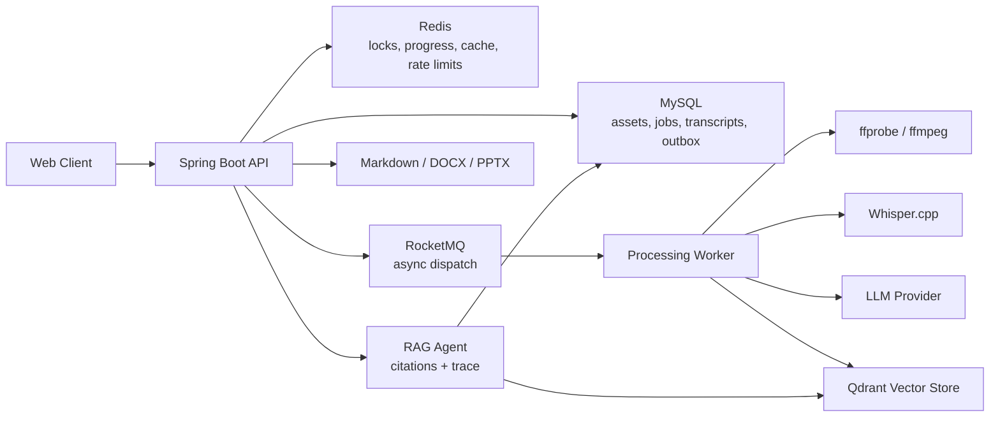

# OmniVid

OmniVid is a full-stack long-video understanding platform for learning videos, meeting recordings and knowledge review workflows. It turns uploaded videos or public video URLs into searchable transcripts, structured summaries, timestamped evidence and multi-video RAG answers.

The project focuses on the engineering problems behind long-video AI applications: large-file upload reliability, long-running media processing, idempotent task recovery, model-call cost control, traceable answers and production-style diagnostics.

## Highlights

- Chunked upload, resumable transfer, MD5 instant reuse and duplicate-video protection.
- MySQL-backed video assets, processing jobs, transcript segments, summaries, chat records and outbox events.
- Redis-backed dedupe locks, progress cache, rate limiting, answer cache and short-term Agent memory.
- MySQL Outbox + RocketMQ dispatch for reliable asynchronous video-processing tasks.
- ffprobe/ffmpeg + Whisper.cpp pipeline for audio extraction, normalization, VAD trimming and ASR transcription.
- Qdrant-backed video RAG Agent with retrieval, rerank, timestamped citations and trace steps.
- Markdown, DOCX and PPTX export based on transcript evidence and structured summaries.
- Runtime inspectors for MySQL, Redis, RocketMQ, vector index, ASR artifacts, SSE and JVM thread pools.

## Architecture



## Tech Stack

| Layer | Stack |
| --- | --- |
| Backend | Java 21, Spring Boot 3, Maven |
| Data | MySQL 8, Redis 7, Qdrant |
| Messaging | RocketMQ, MySQL Outbox |
| AI / Media | Whisper.cpp, ffmpeg, ffprobe, OpenAI-compatible LLM providers |
| Frontend | React, Vite, TypeScript, lucide-react |
| Infrastructure | Docker Compose, Caddy, Nginx, GitHub Actions |

## Quick Start

Start the full local environment:

```powershell
cd E:\video
.\scripts\start-full-docker.ps1
```

Open:

```text
http://127.0.0.1:5174
```

Health check:

```text
http://127.0.0.1:8080/api/health
```

For infrastructure-only development:

```powershell
cd E:\video\infra
docker compose up -d

cd E:\video\apps\api
.\mvnw.cmd spring-boot:run "-Dspring-boot.run.profiles=docker"

cd E:\video\apps\web
npm run dev -- --host 127.0.0.1
```

## Core Workflow

1. Upload a local video or import a public video URL.
2. Create or reuse a video asset through MD5 deduplication.
3. Dispatch processing asynchronously through local DAG or RocketMQ mode.
4. Extract and normalize audio with ffmpeg, then transcribe it with Whisper.cpp.
5. Persist timestamped transcript segments and structured summaries.
6. Build vector indexes in Qdrant for video-grounded RAG.
7. Ask questions against a single video or a multi-video knowledge base.
8. Export grounded reports as Markdown, DOCX or PPTX.

## Engineering Results

Representative local benchmark data:

| Capability | Result |
| --- | --- |
| Large video upload | 139 MB / 76 min video split into 27 chunks at 5 MB each |
| Duplicate upload reuse | Repeated upload hit MD5 reuse in 134 ms |
| Upload-to-job decoupling | Merge and job creation returned in 1.24 s while processing continued asynchronously |
| Long-video processing | 76 min video completed offline parsing in about 798 s |
| Audio pipeline | ffmpeg audio extraction about 136 s; Whisper.cpp transcription about 464.6 s |
| VAD optimization | Short-pause sample reduced invalid audio by about 11.9% |
| Agent cache | Same-question cache hit reduced response time from 234 ms to 39 ms |

## Repository Layout

```text
apps/api      Spring Boot backend
apps/web      React + Vite frontend
infra         Docker Compose, Caddy, Nginx and RocketMQ config
scripts       Local startup, CI and production helper scripts
docs          Public architecture and deployment documentation
```

## Documentation

- [Architecture](docs/architecture.md)
- [Deployment](docs/deployment.md)
- [Benchmarks](docs/benchmarks.md)
- [API Notes](docs/api.md)
- [Infrastructure](infra/README.md)
- [Backend](apps/api/README.md)

## Verification

```powershell
cd E:\video\apps\api
.\mvnw.cmd test

cd E:\video\apps\web
npm run build

cd E:\video
docker compose -f infra\docker-compose.yml --profile app config --quiet
```

## Security Notes

- Provider API keys are stored encrypted and masked in API responses.
- Production startup validates strong secrets, HTTPS public URLs and admin emails.
- Runtime diagnostic endpoints require authenticated admin access.
- Generated videos, transcripts, logs, backups and local model binaries are excluded from the public repository.

## License

MIT
