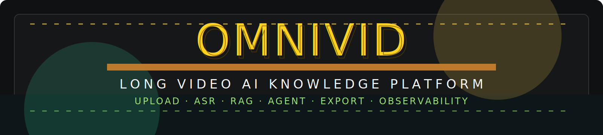
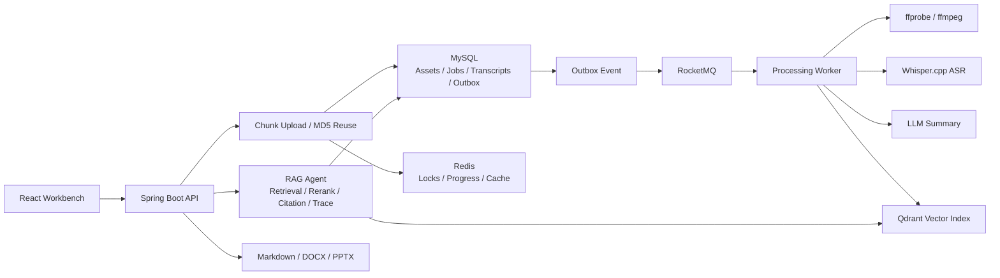

<p align="center">
  
</p>

<h1 align="center">OmniVid</h1>

<p align="center">
  面向长视频学习、会议复盘与知识沉淀场景的 AI 内容理解平台。
  <br />
  将视频上传、音频转写、结构化总结、向量检索、证据问答、文档导出与运行诊断串成一条完整工程链路。
</p>

<p align="center">
  <a href="docs/architecture.md"></a>
  <a href="docs/deployment.md"></a>
  <a href="LICENSE"></a>
  
  
  
</p>

---

## 项目定位

OmniVid 是一个集 **大文件上传、视频解析、ASR 字幕生成、结构化总结、多视频知识库问答和文档导出** 于一体的长视频 AI 知识平台。它重点解决长视频处理中的几个核心问题：

- 大文件上传不稳定，重复上传会造成重复解析。
- ffmpeg、ASR、总结生成和向量索引耗时长，不能阻塞用户请求。
- 大模型回答容易脱离视频证据，需要时间戳引用和置信度守卫。
- 解析链路长、组件多，失败后需要可追踪、可重试、可恢复。

一句话概括：

> OmniVid 用 Java 后端工程能力承接长视频 AI 场景，将“上传 -> 异步解析 -> 字幕时间轴 -> RAG Agent -> 文档导出 -> 诊断恢复”做成可运行、可观测、可复现的完整闭环。

## 核心能力

| 模块 | 做什么 | 工程重点 |
| --- | --- | --- |
| 大文件上传 | 分片上传、断点续传、MD5 秒传、重复视频复用 | 并发防重、唯一索引兜底、上传链路稳定性 |
| 异步解析 | 上传后立即返回任务，后台执行 ffmpeg、ASR、总结、索引 | MySQL Outbox、RocketMQ、状态机 CAS、失败重试 |
| ASR 转写 | ffprobe 探测、ffmpeg 抽音频、VAD 裁剪、Whisper.cpp 转写 | 子进程超时、音频标准化、时间轴映射 |
| 结构化总结 | 生成核心观点、会议纪要、博客大纲、PPT 大纲、工程洞察 | LLM 生成、本地兜底、结果持久化 |
| RAG Agent | 基于字幕证据进行单视频 / 多视频问答 | Qdrant 检索、Rerank、时间戳引用、Trace |
| Redis 加速 | 防重锁、进度缓存、Agent 限流、语义缓存、短期记忆 | Lua 原子操作、TTL、缓存命中与降级 |
| 诊断恢复 | Runtime、MySQL、Redis、ASR、Vector、MQ、线程池诊断 | 可观测性、失败定位、人工补偿 |
| 文档导出 | Markdown、DOCX、PPTX 报告生成 | 证据驱动生成、文件渲染、导出缓存 |

## 技术栈

| 层级 | 技术 |
| --- | --- |
| Backend | Java 21, Spring Boot 3, Maven |
| Database | MySQL 8, Redis 7, Qdrant |
| Messaging | RocketMQ, MySQL Outbox |
| AI / Media | Whisper.cpp, ffmpeg, ffprobe, OpenAI-compatible LLM providers |
| Frontend | React, Vite, TypeScript, lucide-react |
| Infra | Docker Compose, Caddy, Nginx, GitHub Actions |

## 架构链路



## 全流程

1. 用户上传本地视频，或导入公开视频 URL。
2. 后端创建分片上传会话，完成合并后计算 MD5。
3. 命中重复视频时直接复用资产；未命中时创建解析任务。
4. 上传事务写入视频资产、任务记录和 Outbox 事件。
5. RocketMQ 派发后台任务，消费者通过状态机 CAS 幂等推进。
6. ffprobe 探测视频元数据，ffmpeg 抽取并标准化音频。
7. VAD 裁剪无效音频，Whisper.cpp 生成字幕并映射回原视频时间轴。
8. 字幕入库后生成结构化总结，并写入 Qdrant 向量索引。
9. Agent 根据问题召回字幕证据，经过 Rerank 后生成带时间戳引用的回答。
10. 用户可导出 Markdown、DOCX、PPTX，也可通过诊断台排查失败任务。

## 工程数据

| 能力 | 实测结果 |
| --- | --- |
| 长视频上传 | 139 MB、76 分钟视频按 5 MB 拆分为 27 个分片 |
| MD5 秒传 | 重复视频命中复用后请求耗时 134 ms |
| 请求解耦 | 上传合并与建任务 1.24 s 返回，后台异步解析继续执行 |
| 长视频解析 | 76 分钟视频完整后台处理约 798 s |
| 音频处理 | ffmpeg 抽音频约 136 s，Whisper.cpp 转写约 464.6 s |
| VAD 优化 | 短停顿样本减少约 11.9% 无效音频处理 |
| Agent 缓存 | 同一问题缓存命中后响应由 234 ms 降至 39 ms，降低约 83% |

## 快速启动

完整 Docker 复现：

```powershell
cd E:\video
.\scripts\start-full-docker.ps1
```

访问：

```text
http://127.0.0.1:5174
```

健康检查：

```text
http://127.0.0.1:8080/api/health
```

本地开发模式：

```powershell
cd E:\video\infra
docker compose up -d

cd E:\video\apps\api
.\mvnw.cmd spring-boot:run "-Dspring-boot.run.profiles=docker"

cd E:\video\apps\web
npm run dev -- --host 127.0.0.1
```

## 仓库结构

```text
apps/api      Spring Boot 后端服务
apps/web      React + Vite 前端工作台
infra         Docker Compose、Caddy、Nginx、RocketMQ 配置
scripts       本地启动、CI、备份恢复与生产预检脚本
docs          公开架构、部署、Benchmark 与 API 文档
```

## 文档

| 文档 | 内容 |
| --- | --- |
| [Architecture](docs/architecture.md) | 系统架构、模块边界、可靠性设计 |
| [Deployment](docs/deployment.md) | 本地、Docker、生产化启动方式 |
| [Benchmarks](docs/benchmarks.md) | 长视频上传、解析、Agent 缓存数据 |
| [API Notes](docs/api.md) | 核心接口分组 |
| [API README](apps/api/README.md) | 后端启动和接口说明 |
| [Infrastructure](infra/README.md) | Docker 与生产部署说明 |

## 验证

```powershell
cd E:\video\apps\api
.\mvnw.cmd test

cd E:\video\apps\web
npm run build

cd E:\video
docker compose -f infra\docker-compose.yml --profile app config --quiet
```

## 安全与公开仓库说明

- Provider API Key 加密存储，接口返回时脱敏展示。
- 生产配置会校验强密钥、HTTPS 公网地址和管理员邮箱。
- Runtime 诊断接口需要管理员权限。
- 本地视频、转写产物、日志、备份、模型文件和私人规划文档不会进入公开仓库。

## License

[MIT](LICENSE)
