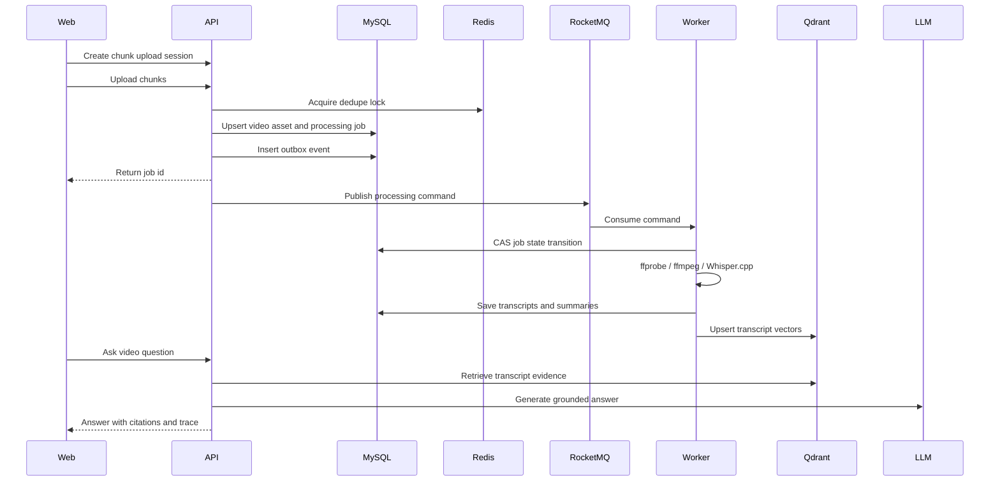

# OmniVid Architecture

OmniVid uses a Spring Boot backend to coordinate large-video ingestion, asynchronous media processing, transcript persistence, vector indexing and evidence-grounded Agent answers.

## System Flow

## Backend Boundaries

| Module | Responsibility |
| --- | --- |
| Upload | Chunk sessions, part persistence, merge, MD5 reuse |
| Video | Video asset metadata, media playback and URL import |
| Job | Processing state machine, retry, compensation and progress |
| MQ | MySQL Outbox, RocketMQ publish/consume and DLQ handling |
| Media | ffprobe probing, ffmpeg extraction, audio normalization and VAD mapping |
| ASR | Whisper.cpp invocation, transcript parsing and diagnostics |
| Summary | Local and cloud structured summary generation |
| Agent | Single-video and knowledge-base RAG, citations, trace and guardrails |
| Export | Markdown, DOCX and PPTX generation |
| Observability | runtime, MySQL, Redis, vector, ASR and JVM inspectors |

## Data Model

- `video_asset`: canonical video metadata and MD5 uniqueness.
- `processing_job`: long-running task state, progress, version and retry metadata.
- `processing_event`: outbox event table for reliable asynchronous dispatch.
- `transcript_segment`: timestamped transcript text for timeline query and retrieval.
- `summary_asset`: structured summaries keyed by video and summary type.
- `chat_message`: Agent conversation and trace persistence.
- `knowledge_base`: multi-video collection for cross-video retrieval.

## Reliability Design

- MySQL is the source of truth for assets, jobs and transcripts.
- Redis handles short-lived coordination: locks, progress, rate limits, answer cache and memory.
- RocketMQ decouples upload requests from media processing workloads.
- Processing consumers use state-machine CAS updates to keep duplicate consumption idempotent.
- Failed tasks are isolated through retry metadata and DLQ-style compensation paths.

