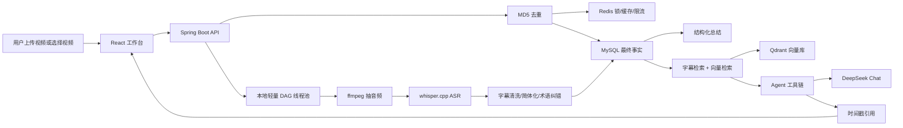

# OmniVid 1.0 技术架构

## 总体链路



## 前端

目录：`E:\video\apps\web`

核心能力：

- 本地视频上传。
- URL 导入入口。
- 视频播放器和 Range 播放。
- 时间轴字幕滚动窗口。
- 字幕点击跳转。
- 结构化总结和 Agent 问答水平切换。
- 云端 LLM、诊断台、视频库右侧交互面板。
- Embedding、知识库管理、运行状态展示。

技术栈：

- React
- Vite
- TypeScript
- lucide-react

## 后端

目录：`E:\video\apps\api`

核心分层：

| 层 | 主要职责 |
| --- | --- |
| Controller | 暴露视频、Agent、知识库、诊断、LLM、Embedding API |
| Service | 编排上传、去重、DAG、ASR、总结、Agent、知识库 |
| Repository | MySQL/H2 数据访问，保留清晰 SQL 钩子 |
| Runtime/Diagnostic | 运行时状态、线程池、MySQL EXPLAIN、Redis Key、ASR 质量 |
| Retrieval | Embedding provider、Qdrant vector store、字幕检索、rerank |

## 数据库

MySQL 是 1.0 的事实层。

关键表：

- `video_asset`：视频资产、MD5、存储路径、状态、版本。
- `processing_job`：异步解析任务、进度、错误、版本。
- `transcript_segment`：字幕片段、时间戳、speaker、content。
- `summary_asset`：核心观点、会议纪要、博客大纲、PPT 大纲、面试钩子。
- `chat_message`：Agent 问答历史。
- `llm_provider_config`：DeepSeek Provider 配置。
- `embedding_provider_config`：Embedding Provider 配置。
- `knowledge_base`：用户知识库。
- `knowledge_base_video`：知识库与视频关系。
- `term_glossary`：ASR 术语词库。

关键索引：

- `video_asset.uk_video_md5`
- `video_asset.idx_video_user_created`
- `processing_job.idx_job_status_updated`
- `transcript_segment.idx_transcript_video_start`
- `transcript_segment.idx_transcript_video_time_cover`
- `summary_asset.uk_summary_video_type`

## Redis

Redis 是 1.0 的高频临时状态层。

| Key 模式 | 功能 |
| --- | --- |
| `video:lock:{md5}` | 上传防重复提交 |
| `omnivid:progress:{videoId}` | 任务进度缓存，SSE 重连补偿 |
| `omnivid:agent:rate:{scope}:{window}` | Agent 限流 |
| `omnivid:agent:semantic:{scope}:{questionHash}` | 精确问题缓存 |
| `omnivid:agent:memory:last-question:{videoId}` | Agent 短期记忆 |

## AI 链路

### ASR

1. ffmpeg 从视频抽取 16k mono `audio.wav`。
2. whisper.cpp 输出 `asr.json`。
3. 字幕进入 `SubtitleTextSanitizer`：
   - 去控制字符。
   - 修复 Latin1/UTF-8 乱码。
   - 转简体。
   - 修正 MySQL、Redis、Qdrant、Embedding、Rerank、AI Agent 等技术词。
4. 低质量视频可通过 ASR 诊断入口查看模型、日志、字幕质量和 OCR 对齐能力。

### 总结

1. 优先调用 DeepSeek Chat。
2. 要求返回结构化 JSON。
3. 成功后按 `video_id + type` 覆盖写入总结资产。
4. 失败时保留或生成本地规则总结，不阻塞主流程。

### Agent

Agent 执行链路：

```text
InputGuardrail
MemoryTool
TranscriptRetrieveTool
VectorRetrieveTool
RerankTool
CitationBuilderTool
AnswerPolicyTool
LlmGenerateTool
ConfidenceGuard
PersistTool
```

1. 命中视频证据：调用 LLM 解释字幕片段，并返回引用。
2. 没命中视频证据：先说明视频或知识库未检索到相关内容，再调用 LLM 做通用回答。
3. 自我介绍等元问题：走 AgentIntroIntent，不强行依赖视频证据。

### 向量检索

- Qdrant collection：`omnivid_transcript_segments`
- 1.0 默认维度：256
- DeepSeek 只保留 Chat LLM。
- Embedding 可配置 OpenAI-compatible provider；未配置时使用本地 hash fallback，保证演示链路可用。
- 1.0 rerank 为本地 rerank，外部 BGE reranker 放入 2.0。

## 启动与运行

后端默认使用 Docker 模式：

```powershell
cd E:\video
.\scripts\start-api-docker.ps1
```

前端：

```powershell
cd E:\video\apps\web
npm run dev -- --host 127.0.0.1 --port 5174
```

## 诊断面板对应接口

| 面板 | API |
| --- | --- |
| Runtime | `GET /api/runtime/status` |
| Health | `GET /api/health` |
| JVM | `GET /api/jvm/thread-pool` |
| MySQL | `GET /api/mysql/explain` |
| Redis | `GET /api/redis/inspect` |
| Vector | `GET /api/vector-index/status` |
| LLM | `GET /api/llm/providers` |
| Embedding | `GET /api/embedding/providers` |
| ASR | `GET /api/videos/{videoId}/asr/diagnostics` |
| Knowledge Base | `GET /api/knowledge-bases` |

## 1.0 架构取舍

- 本地 DAG 先于 RocketMQ：更适合单机 demo 和面试讲清线程池、状态机、幂等。
- MySQL 做事实层，Redis 做性能层：避免把缓存当最终事实。
- Qdrant 外部向量库已接入，但 Embedding provider 保持可降级：避免演示依赖外部服务。
- URL 导入不做反爬绕过：1.0 只提供工程诊断，不处理平台策略对抗。
- 固定 demo 用户：聚焦 Java 后端主链路，权限体系延后。
