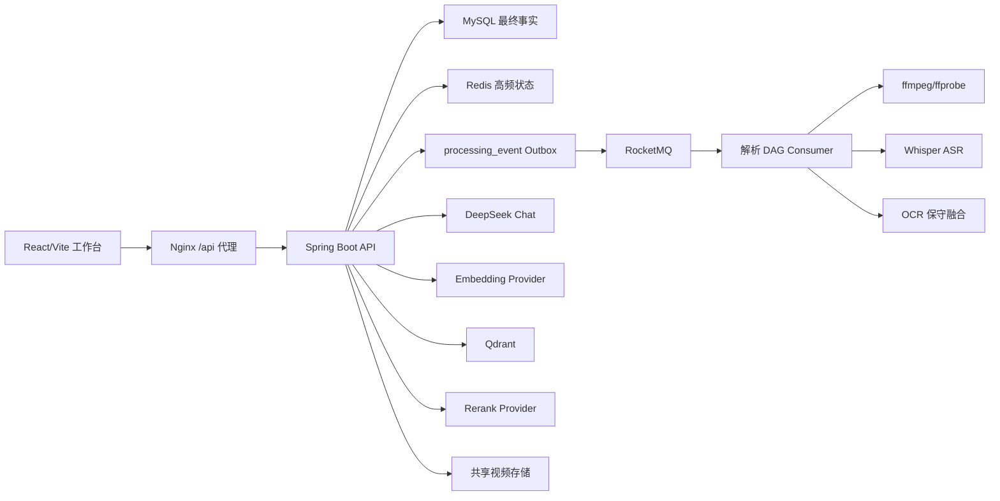

# OmniVid 2.0 技术架构

## 架构目标

2.0 的设计重点不是微服务数量，而是让长耗时视频任务具备可靠投递、可恢复执行、可校正数据和可追溯回答。



## 数据职责

### MySQL：最终事实与状态一致性

- 视频资产、MD5、存储路径和时长。
- 解析任务与乐观锁版本。
- Outbox 事件、重试次数和 DLQ 状态。
- 字幕、字幕版本、总结、聊天记录。
- 知识库与视频多对多关系。
- LLM、Embedding、Rerank Provider 配置。
- 上传会话、分片元数据和术语词库。

MySQL 是所有重要业务状态的最终依据。Redis、Qdrant、文件系统都可以根据 MySQL 或原始文件重建。

### Redis：性能层与短期状态

- MD5 上传防重锁。
- 任务进度缓存。
- Agent 限流。
- Agent 短期记忆。
- Agent 语义回答缓存。

Redis 故障时保留本地降级实现；关键事实不会只存 Redis。

### Qdrant：可重建的语义检索索引

- 字幕片段向量。
- 视频 ID、片段 ID、时间戳等 payload。
- Collection 维度与当前 Embedding 不一致时自动重建。

### 文件系统：视频与解析产物

- Canonical 目录：`apps/api/storage`。
- Docker 容器挂载位置：`/data/omnivid/storage`。
- 保存视频、分片、音频、ASR/OCR 产物和日志。

## 可靠异步设计

上传完成时，视频/任务创建与 Outbox 事件写入位于同一 MySQL 事务。Publisher 只发送 `eventId`，Consumer 再回查数据库并用 CAS 抢占：

```text
HTTP 上传完成
  -> MySQL transaction(video_asset + processing_job + processing_event)
  -> Publisher 扫描 PENDING
  -> RocketMQ
  -> Consumer CAS: PUBLISHED -> CONSUMING
  -> 执行统一解析 DAG
  -> CONSUMED 或 RETRY/DLQ
```

这套设计解决：

- 数据库提交成功但消息丢失。
- Broker 暂时不可用。
- 重复投递和并发消费。
- 消费中应用重启。
- 毒消息阻塞正常批次。

## RAG 与 Agent 链路

```text
问题
  -> InputGuardrail
  -> Redis 多轮短期记忆
  -> MySQL 关键词召回
  -> Qdrant 向量召回
  -> 本地/远程 Rerank
  -> 严格引用过滤
  -> DeepSeek 生成
  -> ConfidenceGuard
  -> MySQL 持久化 + Redis 缓存
```

回答策略：

- 视频有证据：解释视频内容并返回来源与时间戳。
- 视频无证据：明确说明未检索到视频证据，再调用 DeepSeek 给出通用回答。
- Provider 不可用：使用本地模板或本地检索降级，并在执行链路暴露原因。

## 字幕质量设计

- ffmpeg 输出 16kHz 单声道音频并做轻量人声增强。
- Whisper 负责主时间轴和语音内容。
- OCR 作为画面字幕的第二证据源。
- 保守融合只在 OCR 高置信且文本干净时覆盖 ASR。
- `SubtitleTextSanitizer` 负责乱码、繁简、常见术语和控制字符。
- `TranscriptContextRepairService` 只在上下文有证据时修复歧义术语。
- 人工编辑形成版本快照，并触发总结/向量/缓存回流。

## 安全设计

- Provider Key 使用 AES-GCM 加密保存，数据库字段不含明文。
- 前端和接口只返回 mask。
- 新密文前缀为 `enc:v1:`，便于后续密钥版本演进。
- CI、日志和 Git 不保存真实 API Key。
- URL 导入坚持平台合规边界，不绕过反爬、登录、DRM 或 CAPTCHA。

## 可观测设计

- 每个 HTTP 请求生成或继承 `X-Trace-Id`。
- Trace ID 写入响应头和 MDC。
- ProcessingCommand、Outbox payload、RocketMQ user property 与 Consumer MDC 传递同一 Trace ID。
- JSON 日志记录方法、路径、状态、耗时、videoId、jobId、eventId。
- 前端诊断台展示 Runtime、AI/RAG、Data、Recovery 四类状态。

## 降级矩阵

| 故障 | 降级行为 | 保留能力 |
| --- | --- | --- |
| Redis 不可用 | 本地锁/缓存/限流/记忆 | 单实例演示可继续 |
| Qdrant 不可用 | 内存/关键词检索 | Agent 仍可回答 |
| 外部 Embedding 不可用 | `local-hash` | 向量链路继续 |
| 外部 Rerank 不可用 | `local-rerank` | 候选仍可排序 |
| DeepSeek 不可用 | 本地模板/结构化兜底 | 总结和导出不完全中断 |
| RocketMQ 暂时不可用 | Outbox 保留并重试 | 任务不丢失 |
| OCR 不可用 | 仅使用 ASR | 字幕主链路继续 |

## 架构边界

- 当前是模块化单体，不宣称微服务。
- RocketMQ Consumer 当前随 API 部署，后续可拆独立 Worker。
- 当前固定 demo 用户，不宣称已实现多租户。
- 本地存储适合演示与单机部署，后续可替换对象存储。
