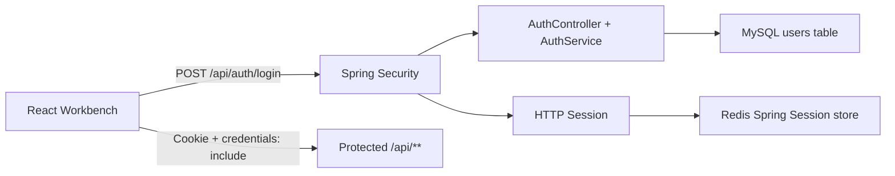

# OmniVid v2.1 Auth Session Blueprint

## Scope

This slice starts the v2.1 login and multi-tenant boundary work with a narrow authentication layer:

1. JSON registration, login, logout and current-user APIs.
2. Spring Security session authentication for `/api/**`.
3. Redis-backed HTTP sessions in Docker/Redis mode.
4. Frontend login/register/logout entry points with cookie credentials.

## Assumptions

- v2.0 history and tags remain untouched.
- `/api/health`, `/api/runtime/status` and `/api/auth/**` stay public so Docker health checks and the login page can boot.
- Existing business data still uses the current demo-user ownership model in this slice. Replacing hardcoded demo user IDs with the authenticated user is the next v2.1 module.
- CSRF is disabled for the local JSON API MVP. This is acceptable for the current local career-demo product, and should be hardened before public SaaS deployment.
- Browser cookies are HttpOnly server sessions, not frontend-managed JWTs.

## Architecture

## Black-Box Validation

1. Add auth/session layer -> 验证: unauthenticated `GET /api/videos` returns `401` JSON.
2. Keep health/runtime public -> 验证: `GET /api/runtime/status` returns `200`.
3. Register/login through JSON API -> 验证: cookie jar can call `/api/auth/me` and `/api/videos`.
4. Use Docker Redis Session -> 验证: Redis contains `spring:session:*` keys after login.
5. Frontend gate -> 验证: first visit shows login/register panel; after login, workbench loads normally.

## Interview Hooks

- Spring Security: filter chain, session authentication, custom `AuthenticationEntryPoint`, 401/403 JSON response.
- Redis: Spring Session, session key TTL, distributed session sharing across app replicas.
- MySQL: unique email index, BCrypt password hash, registration idempotency and duplicate conflict.
- Web: CORS credentials, HttpOnly cookie, SameSite cookie, CSRF tradeoff.
- Multi-tenant evolution: authenticated principal is now available; next module replaces fixed demo user with current user ownership checks.
